# Exercice 03 : Conteneurisation d'une Application Multi-Conteneurs (Docker)

Ce volet technique présente la conception, l'orchestration et le déploiement d'une architecture web dynamique hautement disponible basée sur **WordPress**, entièrement isolée via **Docker Compose** au sein d'un conteneur Linux (LXC) Debian sous l'hyperviseur Proxmox.

---

## 📐 1. Spécifications de l'Architecture Multi-Conteneurs

L'infrastructure applicative est découpée en micro-services spécialisés, interconnectés à travers un réseau virtuel privé isolé (Bridge) :
* **Serveur Front-End (Nginx) :** Gère la réception des flux HTTP sur le port public `80` et fait office de reverse-proxy vers le moteur de script.
* **Moteur d'Exécution (PHP 8.2-FPM) :** Interprète et traite de manière isolée les scripts applicatifs de WordPress.
* **Persistance Relationnelle (MariaDB) :** Système de gestion de base de données (SGBD) sécurisé accueillant les tables de l'application.
* **Volumes de Persistance :** Déclaration de volumes Docker nommés afin de garantir la persistance des fichiers de configuration Nginx, du code source WordPress et des données de la base SQL en cas de reconstruction des conteneurs.

---

## 🚀 2. Guide de Déploiement Étape par Étape

### Étape 2.1 : Mise à Jour et Préparation du Système Hôte
Avant toute installation, l'indexation des paquets Debian est actualisée afin de garantir la sécurité et la stabilité du système :

```bash
root@WordPress:/opt/exercice-03-docker# apt update && apt upgrade -y

```
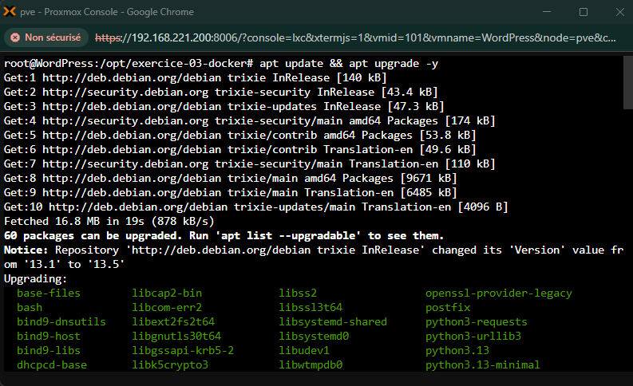

### Étape 2.2 : Déploiement des Dépendances et Clés d'Authenticité

Installation des utilitaires de sécurité (`ca-certificates`, `gnupg`, `curl`) et ajout sécurisé du dépôt d'autorité stable officiel de Docker :

```bash
# 1. Installation des outils requis
root@WordPress:/opt/exercice-03-docker# apt install -y ca-certificates curl gnupg lsb-release wget

```
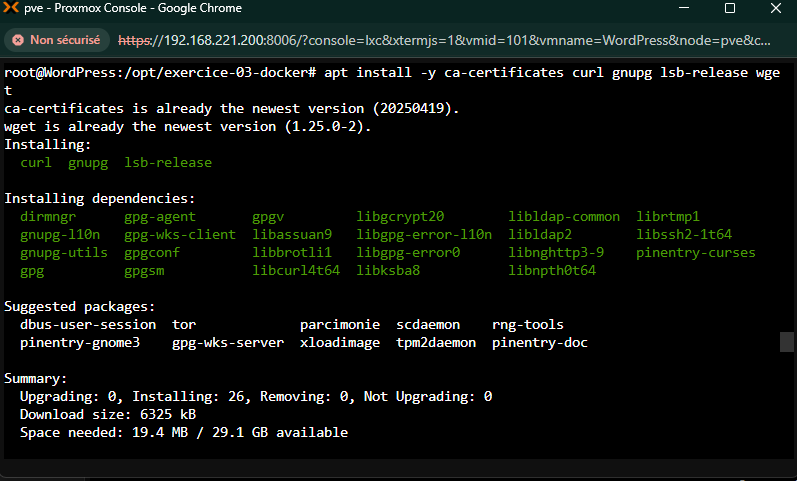

```bash
# 2. Configuration de la clé GPG Docker officielle
root@WordPress:/opt/exercice-03-docker# mkdir -p /etc/apt/keyrings
root@WordPress:/opt/exercice-03-docker# curl -fsSL [https://download.docker.com/linux/debian/gpg](https://download.docker.com/linux/debian/gpg) | gpg --dearmor -o /etc/apt/keyrings/docker.gpg

```
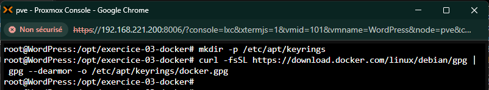

```bash
# 3. Inscription du dépôt stable officiel
root@WordPress:/opt/exercice-03-docker# echo "deb [arch=$(dpkg --print-architecture) signed-by=/etc/apt/keyrings/docker.gpg] [https://download.docker.com/linux/debian](https://download.docker.com/linux/debian) $(lsb-release -cs) stable" | tee /etc/apt/sources.list.d/docker.list > /dev/null

```

---
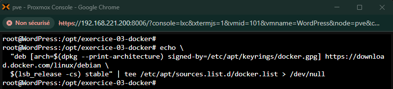

### Étape 2.3 : Installation et Audit du Démon Docker

Mise à jour des catalogues d'installation et déploiement du moteur de conteneurisation `docker-ce` et du greffon `docker-compose-plugin` :

```bash
root@WordPress:/opt/exercice-03-docker# apt update && apt install -y docker-ce docker-ce-cli containerd.io docker-buildx-plugin docker-compose-plugin

```
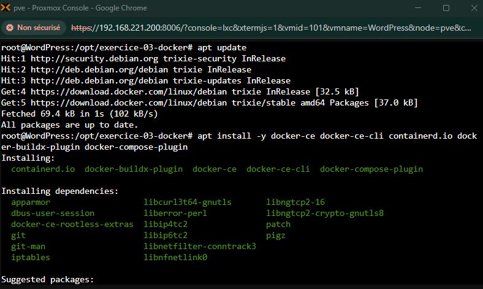

Vérification du statut d'exécution système du service Docker pour s'assurer de son état actif (`running`) :

```bash
root@WordPress:/opt/exercice-03-docker# systemctl status docker --no-pager
root@WordPress:/opt/exercice-03-docker# docker --version
root@WordPress:/opt/exercice-03-docker# docker compose version

```

---
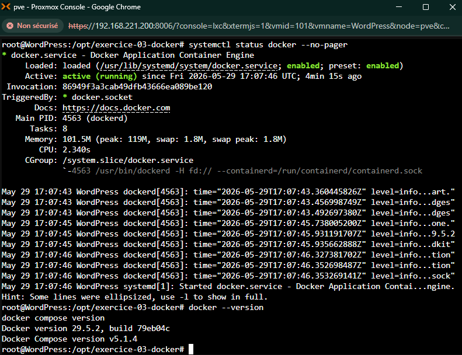

### Étape 2.4 : Conception des Fichiers de Configuration et d'Orchestration

#### A. Le fichier d'orchestration globale (`docker-compose.yaml`)

Création et édition complète du descripteur de l'architecture multi-conteneurs via l'éditeur `nano` :

```bash
root@WordPress:/opt/exercice-03-docker# nano docker-compose.yaml

```
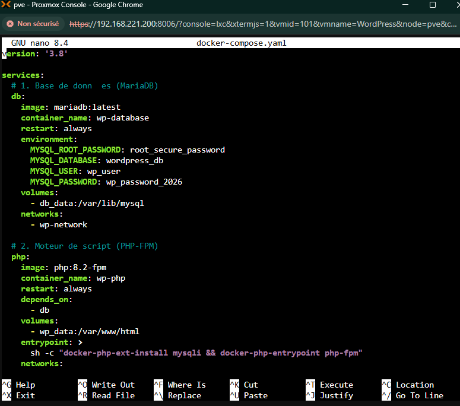

| Déclaration SGBD MariaDB et PHP-FPM | Déclaration Nginx, Volumes et Réseau Bridge |
| --- | --- |
|  |  |

#### B. Configuration du VirtualHost Nginx (`nginx/default.conf`)

Le fichier de configuration interne du serveur web est configuré de manière à router l'interprétation des scripts d'extension `.php` vers l'interface FastCGI du conteneur d'exécution PHP sur le port réseau interne `9000` :

---
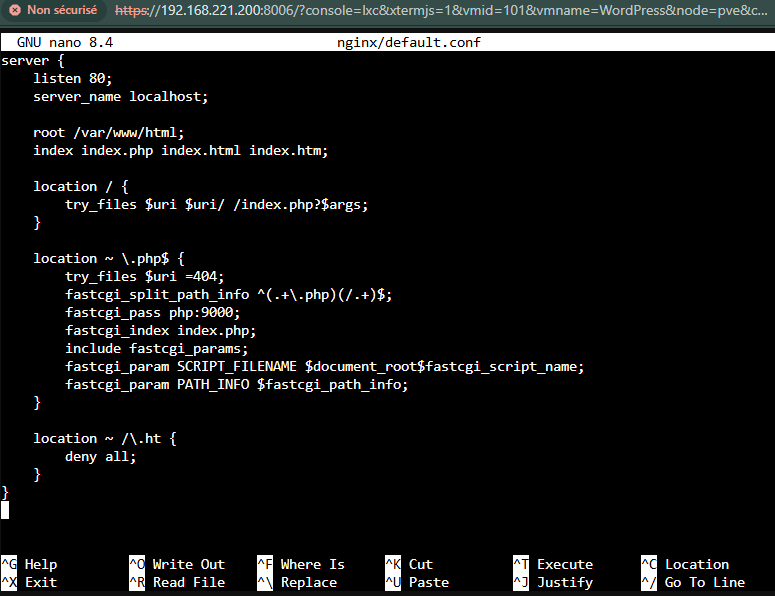

### Étape 2.5 : Intégration et Durcissement des Fichiers Sources WordPress

Récupération de l'archive officielle stable de WordPress, extraction au sein du volume de données partagé, et alignement rigoureux des permissions d'accès au profil d'exécution du serveur web `www-data:www-data` (`33:33`) :

```bash
root@WordPress:/opt/exercice-03-docker# wget [https://wordpress.org/latest.tar.gz](https://wordpress.org/latest.tar.gz)
root@WordPress:/opt/exercice-03-docker# tar -xzf latest.tar.gz
root@WordPress:/opt/exercice-03-docker# cp -r wordpress/* /var/lib/docker/volumes/exercice-03-docker_wp_data/_data/
root@WordPress:/opt/exercice-03-docker# chown -R 33:33 /var/lib/docker/volumes/exercice-03-docker_wp_data/_data/
root@WordPress:/opt/exercice-03-docker# rm -rf wordpress latest.tar.gz

```

---
|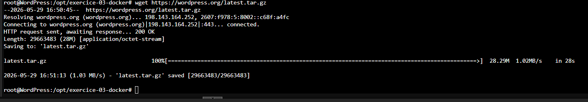 | 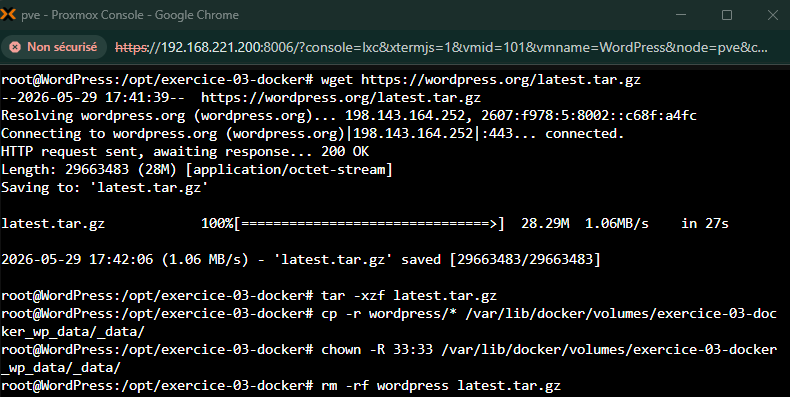 |

### Étape 2.6 : Instanciation et Lancement des Services

Lancement du déploiement en tâche de fond (`daemon`), récupération automatisée des couches logicielles manquantes et validation du statut d'exécution des conteneurs :

```bash
root@WordPress:/opt/exercice-03-docker# docker compose up -d
root@WordPress:/opt/exercice-03-docker# docker compose ps

```

---
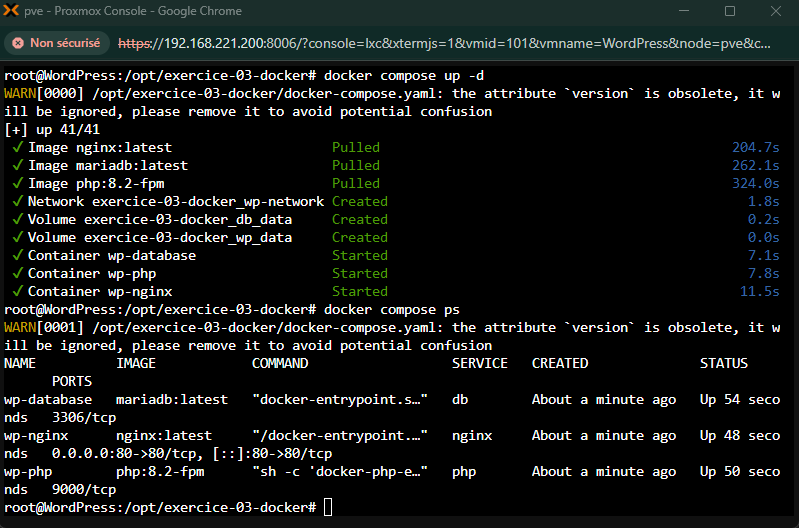

## 🧪 3. Séquence d'Initialisation et Validation Visuelle de l'Application

Une fois l'infrastructure réseau Docker active, la finalisation du déploiement s'opère par requêtage HTTP depuis un navigateur tiers à l'adresse logique de l'hôte : `http://192.168.221.250`.

### Étape 3.1 : Initialisation de la Langue Système

L'application intercepte la connexion initiale et bascule sur l'assistant graphique :

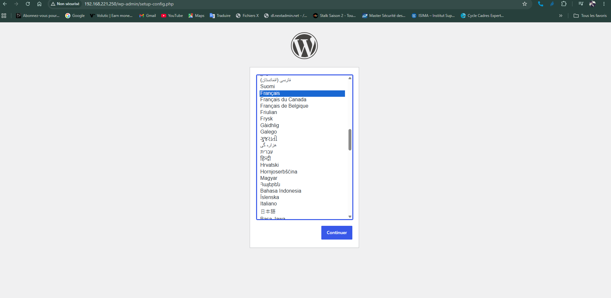

### Étape 3.2 : Rappel des Prérequis d'Infrastructure

Notification de liaison pour valider la préparation des accès à la persistance SQL :

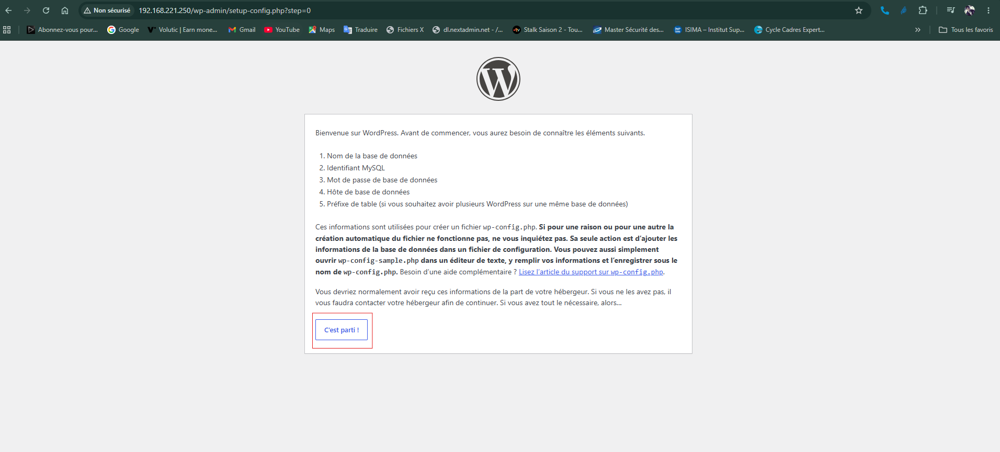

### Étape 3.3 : Configuration des Identifiants de Liaison Base de Données

Saisie des variables d'environnement SQL déclarées dans le fichier Compose. L'hôte de la base de données est référencé par son alias réseau interne **`db`** :

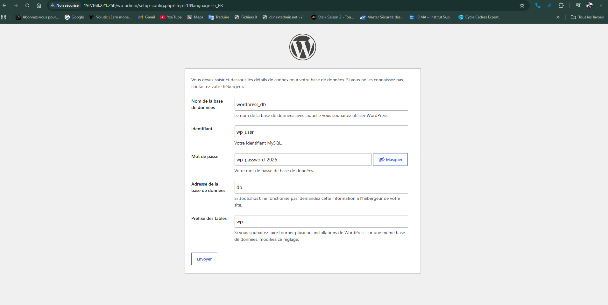

### Étape 3.4 : Validation de la Communication Inter-Conteneurs

L'application valide la réussite du pont de connectivité avec le conteneur MariaDB :

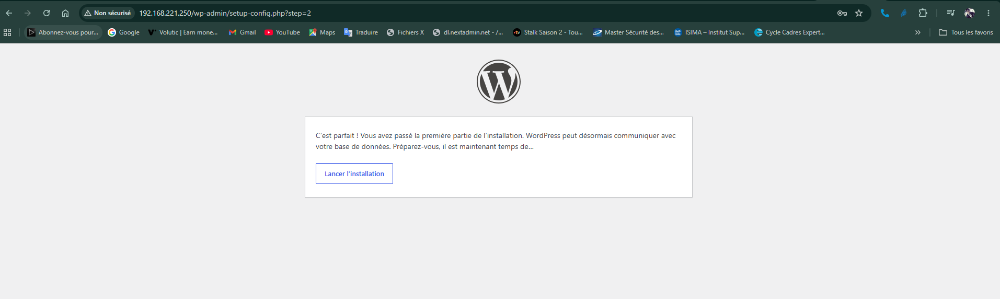

### Étape 3.5 : Création du Compte d'Administration Central

Configuration du titre de la maquette (`MiniLab DevOps`), attribution de l'identifiant privilégié d'administration et génération de la politique de mot de passe :

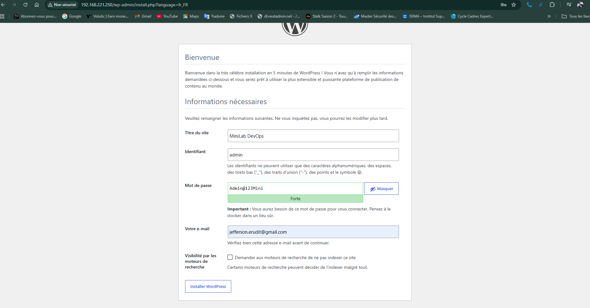

### Étape 3.6 : Validation de l'Écriture des Tables en Base

Confirmation du succès des requêtes SQL d'injection de la structure applicative :

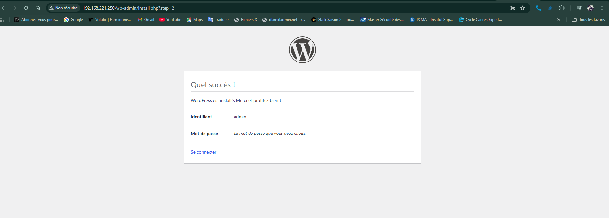

### Étape 3.7 : Authentification Privilégiée

Test de robustesse de la mire de sécurité d'accès au portail d'administration `wp-login.php` :

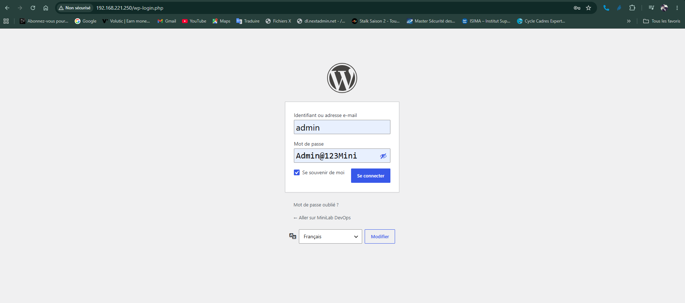

### Étape 3.8 : Validation du Dashboard d'Administration (Console Centrale)

Preuve formelle de conformité : accès réussi à la console d'administration centrale, validant le traitement global de l'architecture multi-conteneurs :

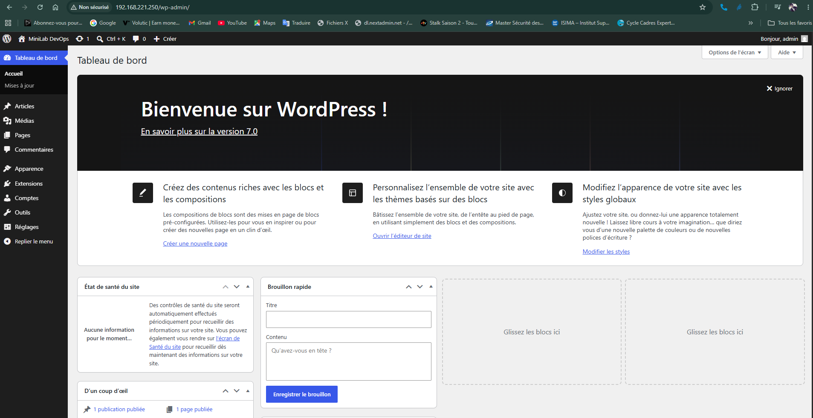

### Étape 3.9 : Validation Visuelle du Rendu Public du Site

Vérification finale de la page d'accueil par défaut accessible aux utilisateurs finaux, confirmant l'affichage fluide et la parfaite synergie fonctionnelle entre Nginx, PHP-FPM et la base de données MariaDB :


---
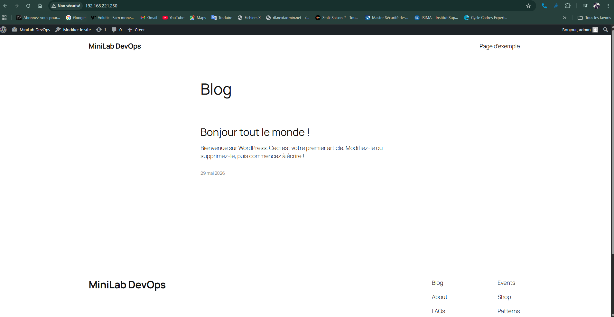

## 🎯 Compétences et Technologies Validées

* **Conteneurisation & Isolation :** Docker Engine / Docker Compose (v2)
* **Serveur Web & Reverse-Proxy :** Nginx (Configuration VirtualHost & FastCGI)
* **Runtime Application :** PHP-FPM (v8.2)
* **Système de Gestion de Base de Données :** MariaDB (Gestion des privilèges & Réseau Docker)
* **Industrialisation des Droits :** Permissions POSIX de bas niveau (`www-data`)
* **Infrastructure Virtuelle :** Debian GNU/Linux (Environnement LXC sous Proxmox VE)
